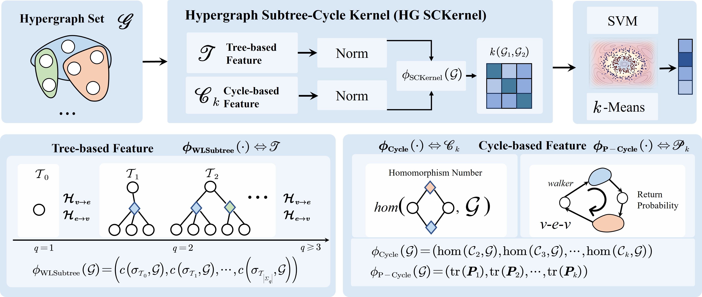
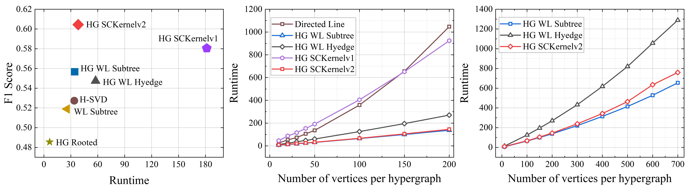
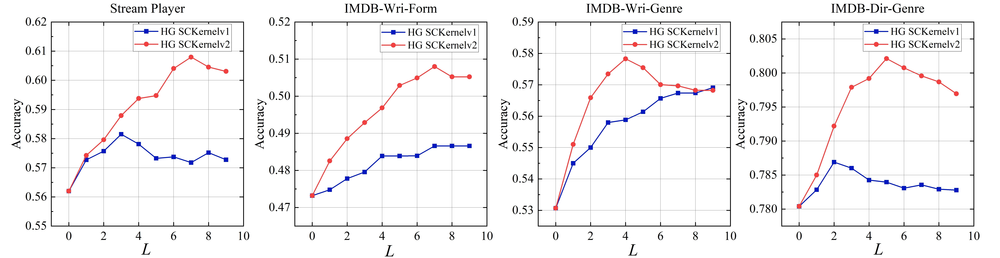
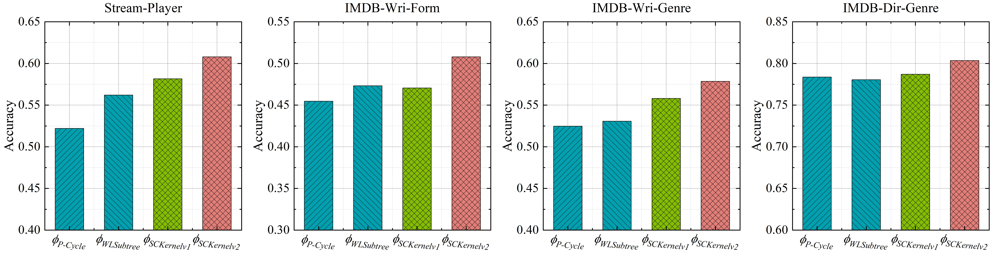

# Reinterpreting Hypergraph Kernels: Insights Through Homomorphism Analysis

This repository contains the code for the paper "Reinterpreting Hypergraph Kernels: Insights Through Homomorphism Analysis" published in IEEE Transactions on Pattern Analysis and Machine Intelligence (TPAMI) 2024 by Yifan Zhang, Shaoyi Du*, [Yifan Feng](https://fengyifan.site/), Shihui Ying, and Yue Gao. The paper is available at [here](https://ieeexplore.ieee.org/document/11159289).



<!-- ## Abstract
Designing expressive hypergraph kernels that can effectively capture high-order structural information is a fundamental challenge in hypergraph learning. In this paper, we propose a novel comparison framework based on hypergraph homomorphisms to evaluate and compare the expressive ability of existing hypergraph kernels. We revisit classical kernels such as Hypergraph Weisfeiler-Lehman (HG WL) and Hypergraph Rooted kernels, providing theoretical conditions under which they fail to distinguish non-isomorphic hypergraphs. Motivated by these insights, we introduce the Hypergraph Subtree-Cycle Kernel, which augments subtree-based features with cycle-based structural patterns to enhance expressiveness. We propose two variants: HG SCKernelv1 and HG SCKernelv2. Extensive experiments on five graph and ten hypergraph classification benchmarks demonstrate the superior performance of our methods, confirming the effectiveness of integrating homomorphism-guided design into hypergraph kernels.
. -->

## Introduction
In this repository, we provide our implementation of HG SKernel and some compared methods including Graph Subtree Kernel, Graphlet Kernel, Hypergraph Directed Line Kernel, and Hypergraph Rooted Kernel. The implementation is based on the following libraries:
* [python 3.9](https://www.python.org/): basic programming language.
* [dhg 0.9.3](https://github.com/iMoonLab/DeepHypergraph): for hypergraph representation and learning. 
* [torch 1.12.1](https://pytorch.org/): for computation.
* [hydra-core 1.3.2](https://hydra.cc/docs/intro/): for configuration and multi-run management.
* [scikit-multilearn 0.2.0](http://scikit.ml/): for multi-label learning.

## Installation
1. Clone this repository.
2. Install the required libraries.
``` bash
pip install -r requirements.txt
```

## Usage
Modify the `root` path in `ml_config.yaml` to the absolute path of the `data` folder in this repository. Then, run the following command to reproduce the results in the paper:
``` bash
python ml_main.py
python cl_main.py
```
Run the following command to reproduce the results of the ablation studies in this paper:
```
python runtime.py
python multi_exp.py
```





You can change the name of `model` and `dataset` in `ml_config.yaml` to reproduce the results of other models and datasets. All available models and datasets are listed in the following:

**Models**
- `graphlet_sampling`: [Efficient
graphlet kernels for large graph comparison. PMLR 2009](https://proceedings.mlr.press/v5/shervashidze09a/shervashidze09a.pdf).
- `graph_subtree`: [Fast subtree kernels on graphs. NIPS 2009](https://is.mpg.de/fileadmin/user_upload/files/publications/NIPS2009-Shervashidze_6080[0].pdf).
- `graph_shortestpath`: [Shortest-path kernels on graphs](https://ieeexplore.ieee.org/abstract/document/1565664).
- `graph_homo`: [Graph Homomorphism Convolution](https://proceedings.mlr.press/v119/nguyen20c.html).
- 
- `hypergraph_rooted`: [Learning from interpretations: a rooted
kernel for ordered hypergraphs. ICML 2007](https://icml.cc/imls/conferences/2007/proceedings/papers/467.pdf).
- `hypergraph_directed_line`: [A Hypergraph Kernel from Isomorphism Tests. ICPR 2014](https://ieeexplore.ieee.org/document/6977378).
- `hypergraph_subtree`: [Hypergraph Isomorphism Computation](https://ieeexplore.ieee.org/document/10398457).
- `H-Motifs`: [Higher-order motif analysis in hypergraphs](https://www.nature.com/articles/s42005-022-00858-7).

**Datasets**
- Graph Classification Datasets: `RG_macro`, `RG_sub`, `IMDBBINARY`, `IMDBMULTI`, `MUTAG`, `NCI1`, `PROTEINS`
- Hypergraph Classification Datasets: `RHG_3`, `RHG_10`, `RHG_table`, `RHG_pyramid`, `IMDB_dir_form`, `IMDB_dir_genre`, `IMDB_wri_form`, `IMDB_wri_genre`, `IMDB_dir_genre_m`, `IMDB_wri_genre_m`, `stream_player`, `twitter_friend`

## Citation
If you find this repository useful in your research, please cite our following papers:
```
@artice{zhang2025rethink,
  author={Zhang, Yifan and Du, Shaoyi and Feng, Yifan and Ying, Shihui and Gao, Yue},
  journal={IEEE Transactions on Pattern Analysis and Machine Intelligence}, 
  title={Reinterpreting Hypergraph Kernels: Insights Through Homomorphism Analysis}, 
  year={2026},
  volume={48},
  number={1},
  pages={466-481},
  doi={10.1109/TPAMI.2025.3608902}
  }

@article{feng2024hypergraph,
  author={Feng, Yifan and Han, Jiashu and Ying, Shihui and Gao, Yue},
  journal={IEEE Transactions on Pattern Analysis and Machine Intelligence}, 
  title={Hypergraph Isomorphism Computation}, 
  year={2024},
  volume={46},
  number={5},
  pages={3880-3896},
  doi={10.1109/TPAMI.2024.3353199}
}

```


